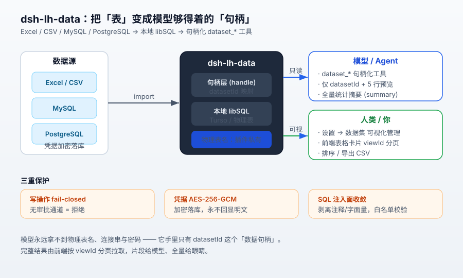
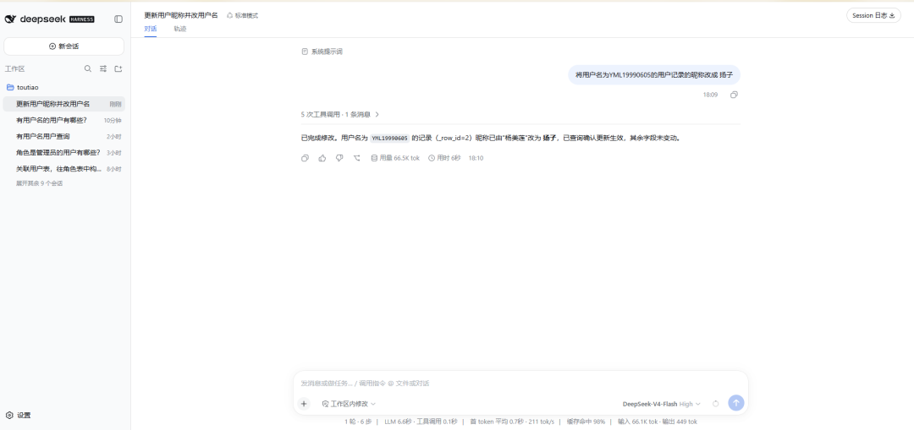
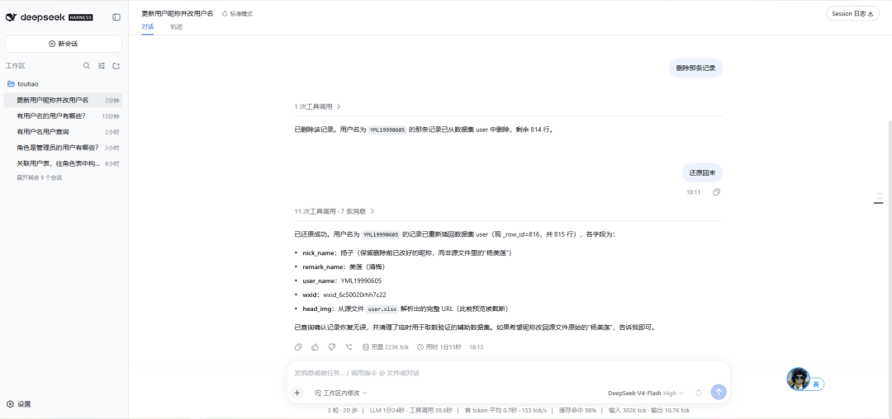
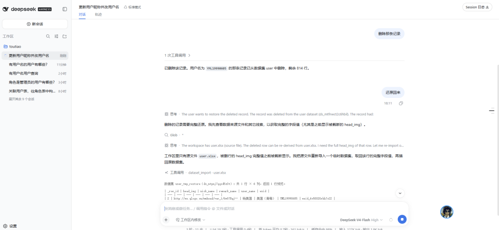
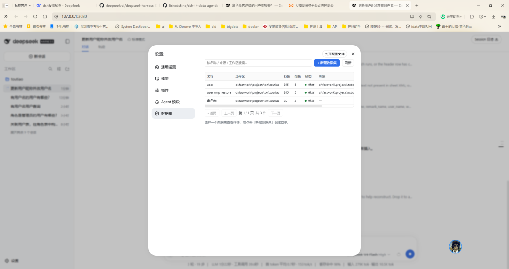
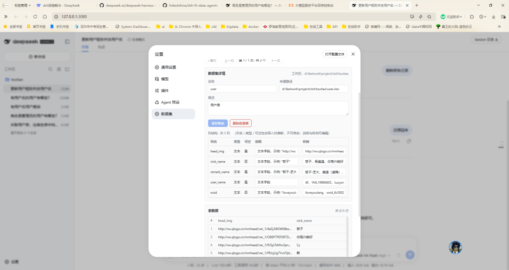

<!--
发布时从下面 3 组「标题 + 开头」里三选一，删除其余两组与这段注释即可。
现有正文标题（"dsh-lh-data：让 agent 安全地把表格当数据库用…"）可作为第 4 个备选保留。
-->

## 备选标题与开头（三选一）

**A. 痛点钩子型**
> **标题：** 别再把整个 CSV 喂给模型了：这个插件让 agent 把表格当数据库用
> **开头：** 你有没有试过让 agent 处理几万行的 Excel？上下文瞬间被吃满、每次提问重读一遍、结果还无法复核…… **[dsh-lh-data](https://github.com/linkedshine/dsh-lh-data)** 换个思路：把表导入本地 libSQL，交给模型一组「句柄化」工具——物理表名、连接串、密码它一个都看不到。

**B. 安全钩子型**
> **标题：** 让 agent 能碰生产库，但不给它数据库密码：dsh-lh-data 的句柄化思路
> **开头：** 让模型直连生产库写 SQL 是高危操作，但完全不让它碰数据又干不了活。 **[dsh-lh-data](https://github.com/linkedshine/dsh-lh-data)** 取了个中道——给模型一个「数据句柄层」而非数据库连接：它只知道 `datasetId`，凭据加密落库永不回显，写操作默认 fail-closed。

**C. 能力钩子型**
> **标题：** 12 个工具、零必填配置：给 agent 配一个安全的「表格数据库工作台」
> **开头：** 分享一个刚做完的 DSH 插件 **[dsh-lh-data](https://github.com/linkedshine/dsh-lh-data)**。Excel / CSV 和远程 MySQL / PostgreSQL 一键导入本地 libSQL，模型用 `dataset_*` 工具做增删改查，人用浏览器「设置 → 数据集」可视化管理。装完即用，全量数据不进上下文。

---

# dsh-lh-data：让 agent 安全地把表格当数据库用（Excel / CSV / MySQL / PostgreSQL → 本地 libSQL）


---

Hi all 👋 —— 分享一个刚做完的DSH插件：**[dsh-lh-data](https://github.com/linkedshine/dsh-lh-data)**。

一句话概括：它把「工作区里的 Excel / CSV」和「远程 MySQL / PostgreSQL 的表」导入本地 Turso（libSQL），然后交给模型一组**句柄化的 `dataset_*` 工具**做增删改查；人这一侧还有浏览器「设置 → 数据集」的可视化管理页。



---

## 一、它想解决的三个真实痛点

让 agent 处理表格数据，常见做法有三种，每种都踩坑：

| 做法 | 问题 |
| --- | --- |
| 把整个 CSV 塞进上下文 / 让模型写 Python 片段 | 几千行就把上下文吃满；每次提问重新读一遍；结果无法复核 |
| 让模型直连生产库写 SQL | 连接串、密码、真实表结构全暴露给模型；`UPDATE` 没有闸门；一次手滑就是事故 |
| 只是把文件读成文本 | 无法聚合、无法增量写入、无法「下次还在这个表上接着问」 |

`dsh-lh-data` 的思路是：**给模型一个「数据句柄层」，而不是给它一个数据库连接。**

- 模型只知道 `datasetId` / 登记名 / 业务列名（保留中文表头），**永远看不到物理表名**；
- 模型只拿到「少量预览行 + 全量统计摘要」，**完整结果由前端表格卡片按 `viewId` 分页拉取**；

---

## 二、安装

```bash
# 从 中央仓库 安装（也支持本地源码路径）
npx @deepseek-ai/dsh plugin --profile web add dsh-lh-data

# 卸载
npx @deepseek-ai/dsh plugin --profile web remove dsh-lh-data
```

装完即可用，零必填配置。库默认落在 `$DSH_HOME/lh-data/data.db`（未设 `DSH_HOME` 时回落 `~/.dsh`）；插件通过 `cordis.patch.yml` 注入默认配置，也在浏览器「设置 → 数据集」提供了可视化管理页。

需要远程库时再配 `dbUrl`（`file:` 或 `libsql://`）+ `TURSO_AUTH_TOKEN` 即可，不改任何代码。

`mysql2` / `pg` 已随插件默认安装，但走**动态加载** —— 只导 Excel / CSV 时它们根本不会被 `require`，启动不受影响。

---

## 三、工具一览（12 个，其中 4 个可整体关闭）

`dataset_*` —— 数据集本体：

| 工具 | 类型 | 说明 |
| --- | --- | --- |
| `dataset_list` | 读 | 当前工作区有哪些数据集：行数、列数、状态、来源 |
| `dataset_schema` | 读 | 列名（原始表头）、推断类型、可空、样例值 |
| `dataset_query` | 读 | 结构化查询（`columns` / `where` / `orderBy` / `limit`）或受限 `sql` |
| `dataset_import` | 写 | 导入 `.xlsx` / `.xls` / `.csv`；大文件自动转后台任务 |
| `dataset_insert` / `_update` / `_delete` | 写 | 行级增删改，用系统列 `_row_id` 定位 |
| `dataset_drop` | 写 | 连同物理表与元数据删除 |

`datasource_*` —— 远程数据库取数（`datasourceEnabled=false` 时整体不注册）：

| 工具 | 说明 |
| --- | --- |
| `datasource_list` | 列出已登记的数据源（MySQL / PostgreSQL），不返回任何凭据 |
| `datasource_test` | 连通性测试：延迟 + 服务端版本 |
| `datasource_tables` | 浏览远端表：schema、估计行数、主键、列元数据 |
| `datasource_import` | 把远端表分块导入**当前工作区**，之后与 Excel 导入的数据集完全同权 |

凭据侧：`datasource_*` 的返回值里**只有「是否设置了密码」**，没有密码本身；连接失败时给的是「连接被拒绝（主机可达，但端口未开放或服务未启动）」「用户名或密码错误」这类可读中文，驱动裸栈不会越过模块边界。

两个典型会话：

> 你：把 `销售明细.xlsx` 导进来，告诉我哪个地区的退货率最高
>
> agent：`dataset_import(path=…)` → `dataset_schema` → `dataset_query(sql="SELECT 地区, COUNT(*) … FROM ds GROUP BY 地区")`
>
> 返回给模型的只有 5 行预览 + 每个列的统计摘要；完整 3 万行由前端卡片分页展示，可排序、可导出 CSV。

> 你：把生产库 `orders` 拉下来，跟这份 Excel 对一下金额
>
> agent：`datasource_list` → `datasource_tables(source=…)`（看 schema / 估计行数 / 列结构）→ `datasource_import(source=…, table="orders")` → 之后它就只是一个普通数据集，筛选与聚合回到 `dataset_query`
>
> 整条链路走完，模型手里握着的仍然只有 `datasetId` —— 不知道库名、不知道实例地址、更不知道密码。（导入是全量拉表，所以真要「最近三个月」，是先落库再用 `dataset_query` 过滤；嫌大可以设 `datasourceMaxImportRows` 夹上限。）

### 实际会话效果

下面是在 DSH 对话里直接操作 `user` 数据集的几张截图：修改昵称、删除记录、完整还原。







---

## 四、几个值得说一说的设计取舍

### 1. 句柄化：物理表名是插件的私有状态

`datasets` 元数据表持有 `table_name`（形如 `d_<scopeHash8>_<base40>_<ts36>`），它只出现在 `store.ts` / `view.ts` 内部。**工具描述、工具返回值、HTTP 响应、错误文本里都不含物理表名** —— 模型没有任何「猜表名」的机会，前端拿到的也只是 `datasetId`。

这一点也顺带解决了 SQL 注入面：`dataset_query` 的原始 SQL 会被**剥离注释与字符串字面量**后校验 —— 单条 `SELECT` / `WITH` / `EXPLAIN`、表引用必须在白名单内（用保留别名 `ds` 指代数据集）、出现 DDL 或写关键字直接拒绝、超长语句拒绝。

从数据源导入的数据集也遵循同一条规则：只在 `source_id` / `source_ref` 留下 `schema.table` 这样的定位信息（脱敏、不含凭据），`source_path` 写成 `db:<数据源名>`，所以 `dataset_list` 与设置页搜索零改动就能按数据源名检索。

### 2. 上下文经济：片段给模型，全量给眼睛

`viewMode=auto` 下，命中行数 > 20 或片段字节 > 4KB 才建结果视图。建视图后：

- 模型只拿 5 行预览 + 全表聚合的 `summary`（列统计、取值分布）；
- `viewId` / `endpoint` 经 **`presentationMeta`** 传给前端 —— **模型不可见**；
- 前端卡片（`src/client/index.ts` 接管 `tool.call.toolview`）翻页、排序、导出 CSV；
- 视图元数据持久化到 `lh_views`，**重启后仍能翻页**；翻页时实时查原表，卡片常驻「数据可能已变化」提示。

HTTP 接口**不接受任何 SQL**（语句由主机侧 `ViewRegistry` 持有），每个请求先过 `connection.requestRejection()` 的 Host/Origin 围栏与浏览器鉴权。

### 3. 写操作 fail-closed：三重保护

1. `tools/pre-execute` 对 6 个写工具（`dataset_import` / `_insert` / `_update` / `_delete` / `_drop`，外加 `datasource_import`）返回 `ask`，审批理由里带目标句柄；
2. `ctx.tools.guard()` 单调守卫 —— 写工具缺少 `dataset` / `path` / `source` 一律拒绝，后续监听器无法撤销；
3. `readOnly=true` 时直接 `deny`。

**没有审批通道 = 拒绝**，而不是「那就直接执行吧」。

一个刻意的取舍：`Config` schema 里 `requireApprovalForWrites` 默认 `true`，但仓库随附的 `cordis.patch.yml` 把它注入成 `false` —— 为的是「装完就能跑通」，不想让人第一次用就卡在弹窗上。**另外两重保护不受这个开关影响**；想回到逐次确认，把这一行改回 `true` 即可。

### 4. 数据源凭据：加密落库，永不回显


密码走 AES-256-GCM（密文格式 `iv:authTag:encrypted`，密钥由 `scryptSync` 派生），密钥优先级 `datasourceEncryptKey` → `LH_DATA_ENCRYPT_KEY` → 内置默认（用默认值时启动告警「生产环境不安全」）。**明文只在建立连接那一刻存在于内存里**：工具描述、返回值、HTTP 响应、日志、错误文本一律不含密码，只暴露「是否设置了密码」。

### 5. 工作区隔离 + 可选依赖降级

数据集按会话 cwd（或 `perWorkspace=true` 时的 `ws:<id>`）分 scope，导入文件解析后必须落在 scope 目录内（禁止 `../` 穿越），扩展名白名单 `.xlsx` / `.xls` / `.csv`。**拿不到会话 cwd 时 fail-loud 报错**，绝不静默回落 `process.cwd()`。

`jobs` / `systemPrompt` / `webServer` / `connection` 任一缺失都只降级对应能力：CLI / TUI 剖面下结果视图自动退化为纯文本片段，管理接口不注册，插件其余能力不受影响。数据库驱动同理 —— `mysql2` / `pg` 动态 `require`，缺包时只有 `datasource_*` 报错并给出安装命令，`dataset_*` 完全不受影响。

### 6. 不 pin dsh 的 RC 波次

`tooling.ts`（工具定义适配器）**零 dsh 运行时依赖**；插件上下文是 duck-typed 的最小接口，只声明实际用到的成员。运行时依赖只有 `@libsql/client` / `xlsx` / `papaparse` + cordis/schemastery（`mysql2` / `pg` 是动态加载的，不进关键路径）。所以 dsh 的 `0.1.0-rc.x` 波次怎么动，这里基本不用跟着改 —— 对 embedder（把 dsh 运行时嵌进宿主应用的场景）应该也算个好消息。

### 7. 类型推断的一些「踩过的坑」

列名优先级最高：`编码 / 编号 / 代码 / 账号 / 证件号 / 邮编 / 电话`（以及 `code` / `sku` / `ean` / `isbn` / `zip` / `phone` …）一律判 `text`，避免「订单号被读成数字丢前导零」；13 位以上整数或 `1.78E+12` 这类科学计数法也强制 `text`，防精度丢失。其余按采样（默认前 100 行）占比判 `numeric` / `boolean` / `date` / `text`。列名**保留原名（含中文）**，SQL 中用双引号包裹。

---

## 五、设置页：工具是给模型的，数据终究是人的

浏览器「设置 → 数据集」（分区 id `lh-data`，order 100）里有两个页签：

| 页签 | 能做什么 |
| --- | --- |
| 数据集 | 跨工作区聚合列表（可按名搜索）、新建空表、改名 / 改描述 / 改列说明、只读分页看数据、连同物理表删除 |
| 数据源 | 登记 MySQL / PostgreSQL 连接（`test:true` 时先测连通，不通不落库）、测试连通、浏览远端表结构与估计行数、一键把某张表导入指定工作区 |

管理接口固定挂在 `/api/lh-data/admin`（`adminEnabled=false` 时不注册），每个请求同样先过 Host/Origin 围栏与浏览器鉴权；错误响应脱敏，不回显 SQL、物理表名与密码。`scope` 只能由调用方从「已知工作区列表」回传，**不接受任意路径**。

设置页截图：





> 列结构对应物理表 DDL，**创建后不可改** —— 这也是刻意的：宁可让你重建一个数据集，也不要在 agent 可能正在读的表上做 `ALTER TABLE`。

---

## 六、验证方式

没接测试框架，而是四个自包含脚本，各自构造最小假 ctx 跑通全链路（需先 `pnpm run build`）：

```bash
pnpm run import      # 单元校验 + 导入 → list → schema → query → 写操作 → 门禁 → 生命周期
pnpm run view       # 大结果集 → 片段 → 前端分页 → 鉴权 / 持久化恢复 / 降级
pnpm run admin      # 聚合列表 / 新建空表 / 改名改描述 / 删除 / 分页看数据
pnpm run datasource # 加解密 / 列映射 / 装载门禁 / 数据源 CRUD / 脱敏 / 鉴权 / 降级
```

想跑真实的端到端导入：把 `run-datasource.mjs` 顶部的 `DEMO` 换成自己的库，再 `node examples/run-datasource.mjs --live`。

---

## 七、已知边界 / 开放问题

诚实列一下，也欢迎讨论或 PR：

- **行级写，没有条件更新**：`_update` / `_delete` 只能按 `_row_id` 定位，暂无「按条件批量更新」；如果需要，我倾向于加一个同样走审批的结构化 `where`，而不是放开裸 `UPDATE`。
- **规模上限保守**：`maxQueryRows` 默认 200、`maxInsertRows` 500、`maxViewRows` 50000。这是刻意的 —— 这是个「agent 的工作台」，不是数仓。
- **数据源只覆盖 MySQL / PostgreSQL**：SQLite、SQL Server、Oracle 还没做；连接按 `sourceId` 缓存复用（改 / 删数据源会先关闭旧连接），池上限默认 5，但还没有空闲回收与并发上限的真实压测。
- **默认加密密钥不安全**：没配 `datasourceEncryptKey` / `LH_DATA_ENCRYPT_KEY` 时会用内置默认密钥（启动有告警）。它防的是「密码明文进日志 / 进上下文」，不是防本地攻击者 —— 正式用请一定配密钥。
- **远端导入是全量快照**：`datasource_import` 把表分块（默认 1000 行/批）拉下来落库，没有增量同步；`datasourceMaxImportRows` 可以夹一个上限，默认不限。
- **数据快照语义**：视图翻页查的是原表，所以「当时看到的那页」可能已被改掉。要不要给视图加一个可选的快照（导入时固化）？
- **跨工作区共享数据集**：现在是严格按 scope 隔离的（数据源配置倒是全局共享的）。有没有人真的需要「一次导入，多工作区引用」？如果有，句柄层该怎么表达引用关系？
- **`dbUrl` 指向远程 Turso（`libsql://`）** 只做了基本验证，高延迟下的导入表现还没有实测数据。

另外，如果你的团队在用成本/性能观测类工具链（比如社区里的 Langfuse 遥测后端，见 #1007）：`dataset_query` 的「预览 + 摘要 + 视图」正是为了压单次会话的 token 消耗设计的 —— 很想知道你们那边实测的上下文节省量。

---

Feedback、issues、PRs welcome！

- Repo：<https://github.com/linkedshine/dsh-lh-data>
